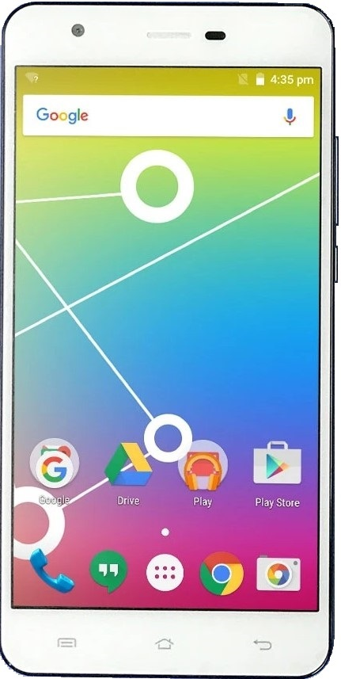
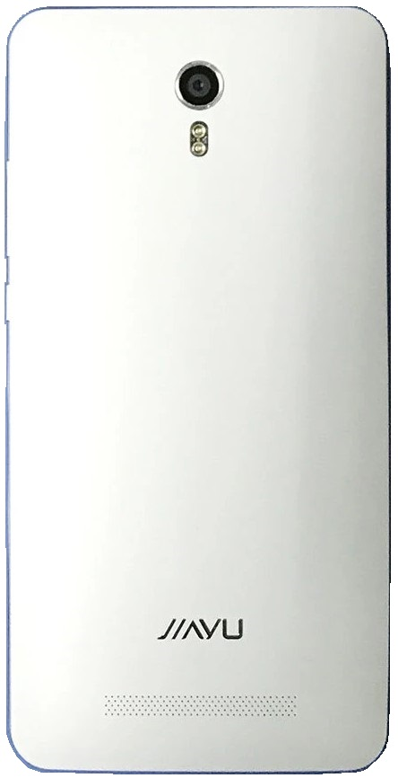

# LineageOS 14.1 device tree for Jiayu S3 (s3_h560)

JIAYU S3
==============

Basic   | Spec Sheet
-------:|:-------------------------
CPU     | 1.7GHz Quad-Core MT6752
GPU     | Mali-T760
Memory  | 2GB/3GB RAM
Shipped Android Version | 4.4
Storage | 16GB
Battery | 3000 mAh
Display | 5.5" 1080 x 1920 px
Camera  | Front: 5.0MPx, Back 13MPx, LED Flash

